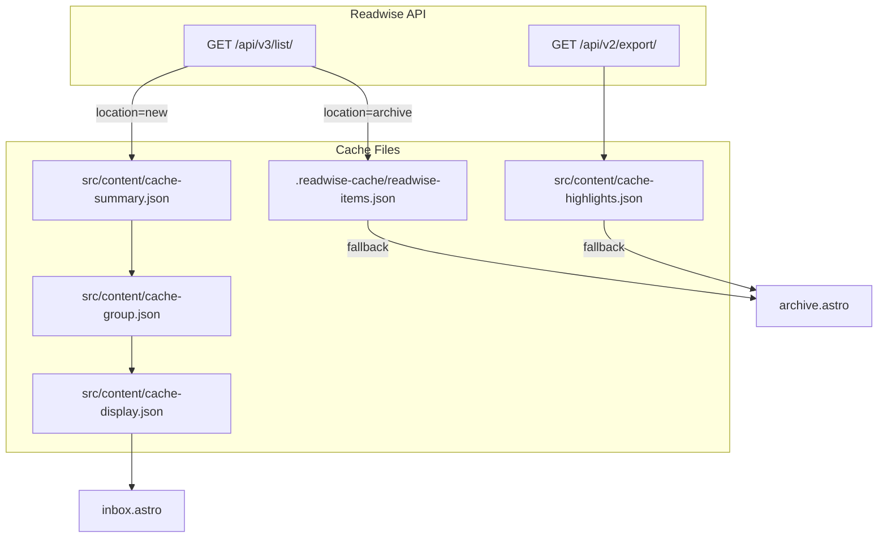
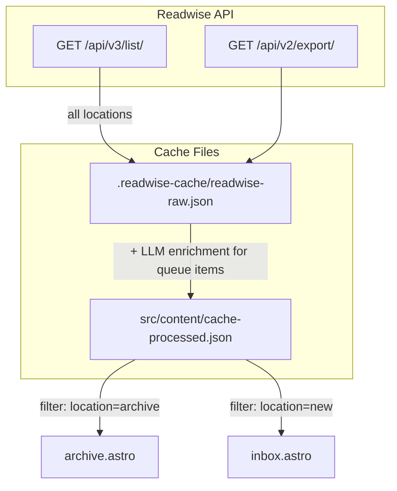

# Unify Readwise Caches

## Current State -- 5 Cache Files



- `.readwise-cache/readwise-items.json` -- raw API items (network fallback only)
- `src/content/cache-highlights.json` -- highlights by doc ID (network fallback only)
- `src/content/cache-summary.json` -- LLM broad tags + summaries (intermediate)
- `src/content/cache-group.json` -- LLM consolidated tags + order (intermediate)
- `src/content/cache-display.json` -- final queue display data

## Target State -- 2 Cache Files



- **Raw cache** (`.readwise-cache/readwise-raw.json`) -- all Readwise API data (items from all locations + highlights). For local dev workflows.
- **Processed cache** (`src/content/cache-processed.json`) -- unified items used by Astro at build time.

### Processed cache item schema

```typescript
type ProcessedItem = {
	readwise_id: string;
	title: string;
	url: string;
	tags: string[]; // broad LLM tags (empty for non-LLM-processed items)
	display_tags: string[]; // consolidated 5 display tags (empty for non-LLM-processed)
	category: string; // article, pdf, etc.
	location: string; // archive, new, later, shortlist, feed
	last_moved_at: string; // ISO date string
	date_group: string; // formatted date for archive grouping
	highlights: string[]; // highlight texts (empty if none)
	summary: string; // LLM summary (empty for non-queue items)
	order: number; // LLM ordering (0 for non-queue items)
};
```

## Changes by File

### 1. `src/content/readwise.ts` -- major simplification

**Remove:**

- `saveToCache()`, `loadFromCache()` -- no more per-loader caching
- `saveHighlightsCache()`, `loadHighlightsCache()` -- folded into raw cache
- `loadReadwiseArchive()` -- replaced by unified loader
- `loadReadwiseQueue()` -- replaced by unified loader
- `READER_ITEMS_CACHE_FILE`, `HIGHLIGHTS_CACHE_FILE` constants

**Keep (for use by the build script):**

- `fetchAllReadwiseReaderItems()` -- fetches items from API
- `fetchAllReadwiseHighlightsBySourceUrl()` -- fetches highlights from API
- `normalizeUrlForJoin()` -- URL normalization helper
- Type definitions (`ReadwiseItem`, `ReadwiseApiDocument`, etc.)

**Add:**

- `loadProcessedCache()` -- reads `cache-processed.json`, returns all items
- `loadReadwiseArchive()` -- calls `loadProcessedCache()`, filters `location === "archive"`, returns items shaped for the archive page
- `loadReadwiseQueue()` -- calls `loadProcessedCache()`, filters `location === "new"`, returns items shaped for the inbox page

### 2. `src/content/llm.ts` -- modify CLI entry point

The `main()` function becomes the unified build script:

1. Fetch ALL Readwise items (no location filter) via `fetchAllReadwiseReaderItems`
2. Fetch all highlights via `fetchAllReadwiseHighlightsBySourceUrl`
3. Write raw cache (`.readwise-cache/readwise-raw.json`) with items + highlights
4. For queue items (`location === "new"`, `category === "article"`): run LLM summarize + group (keep existing logic, use `.readwise-cache/llm-summary.json` and `.readwise-cache/llm-group.json` as internal optimization caches)
5. Build unified `ProcessedItem[]` for ALL items and write `src/content/cache-processed.json`

LLM intermediate caches move from `src/content/` to `.readwise-cache/` so they don't pollute the content directory. They remain as optimization caches to avoid re-running expensive LLM calls.

### 3. `src/content/config.ts` -- minor adjustment

- Both collection loaders read from the same processed cache (via the new helpers in `readwise.ts`)
- Update schemas to match `ProcessedItem` fields (rename `id` -> `readwise_id`, add `display_tags`, etc.)

### 4. Page updates

- `**archive.astro`: Update field references (`item.data.id` -> `item.data.readwise_id`, `item.data.url.href` -> `item.data.url`)
- `**inbox.astro`: Update field references similarly, use `display_tags` instead of `tags` for UI display

### 5. Delete old cache files

Remove from repo / `.gitignore`:

- `src/content/cache-highlights.json`
- `src/content/cache-summary.json`
- `src/content/cache-group.json`
- `src/content/cache-display.json`
